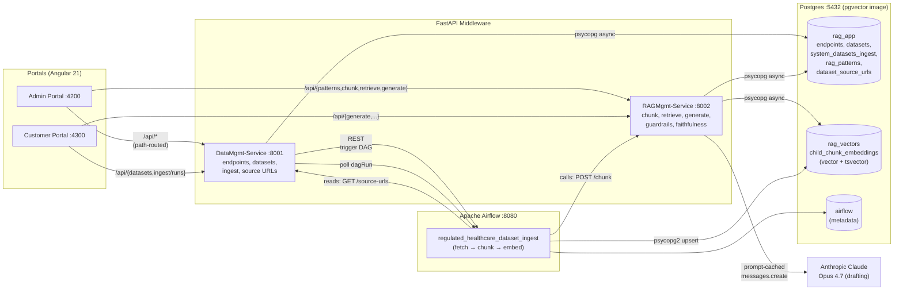
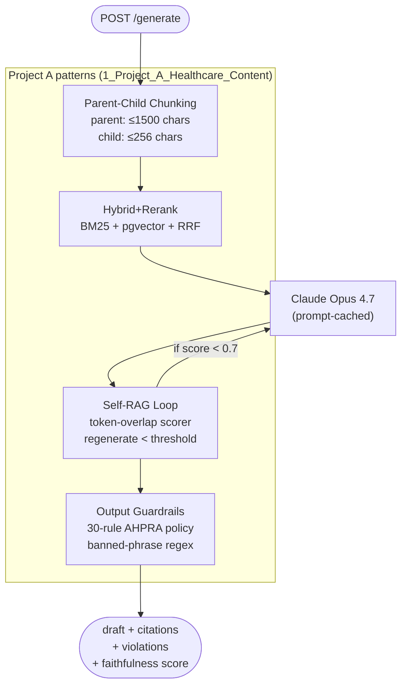
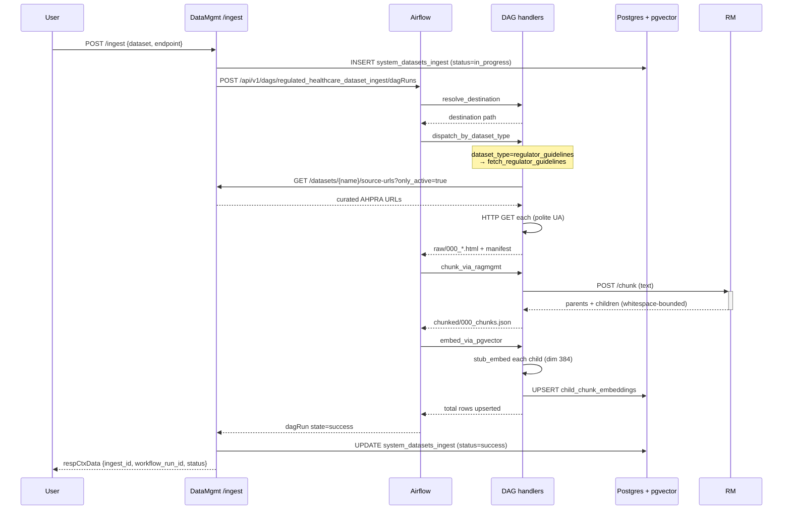
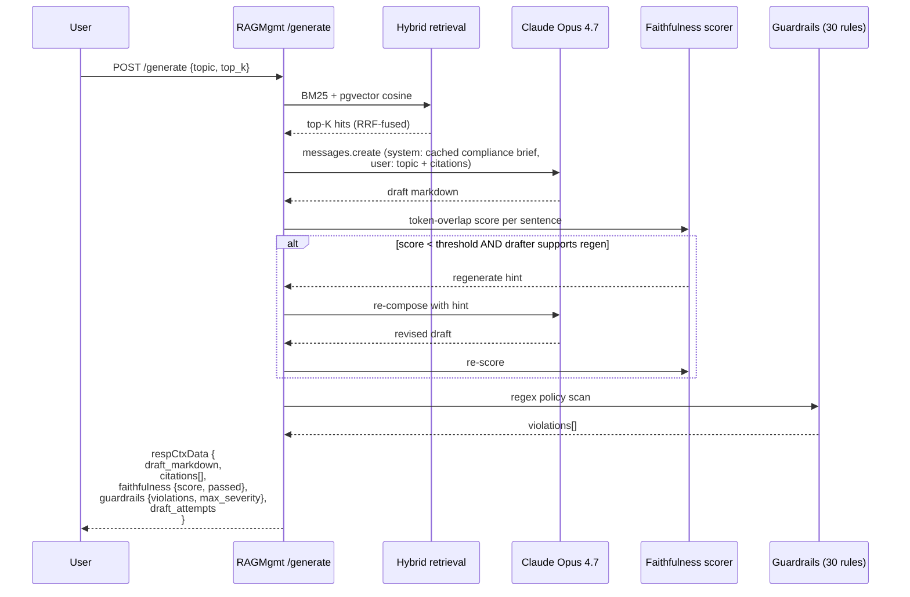

<div align="center">

# Regulated Healthcare Practice Content RAG

**A compliance-first RAG stack for allied-health practices in regulated jurisdictions.**
*Every claim must map to a citable source. Every draft must clear the regulator's banned-phrase line.*

[](LICENSE)
[](#project-status)
[](https://github.com/javakishore-veleti/Regulated-Healthcare-Practice-Content-RAG/commits/main)
[](https://www.python.org/)
[](https://fastapi.tiangolo.com/)
[](https://angular.dev/)
[](https://github.com/pgvector/pgvector)
[](https://airflow.apache.org/)
[](https://www.anthropic.com/)

</div>

---

## Why this exists

A general-purpose LLM, given the prompt *"write SEO content for a physiotherapy clinic,"* will cheerfully produce a paragraph that breaches AHPRA's advertising guidelines in the first sentence — a testimonial here, a *"guaranteed pain-free results"* there, a *"#1 clinic in town"* superlative for flavour. In Australia under AHPRA, the United States under FTC health-claim rules, and other regulated jurisdictions, that draft is a compliance incident waiting to happen.

This project is the opposite posture. Every draft is **grounded** in (a) the public regulator's published advertising rules, (b) the practice's own voice corpus, and (c) open-access clinical evidence. Every claim maps to a retrievable, citable source. Every output is filtered through a **30-rule banned-phrase guardrail**. Every draft is **scored for faithfulness** before it leaves the building, and regenerated if it falls below threshold.

It's a working implementation of the four Project A patterns from [`RAG_Mastery_Projects.xlsx`](../RAG_Mastery_Projects.xlsx) — Hybrid+Rerank, Parent-Child Chunking, Self-RAG faithfulness loop, and Output Guardrails — running end-to-end against a real Anthropic Claude drafter, an Airflow ingest pipeline, and a Postgres+pgvector store, with two Angular portals on top.

---

## Table of contents

1. [Architecture at a glance](#architecture-at-a-glance)
2. [The four Project A patterns](#the-four-project-a-patterns)
3. [Repository layout](#repository-layout)
4. [First-time setup](#first-time-setup)
5. [Daily workflow](#daily-workflow)
6. [Service URLs and ports](#service-urls-and-ports)
7. [The ingest pipeline](#the-ingest-pipeline)
8. [The generate pipeline](#the-generate-pipeline)
9. [Common tasks](#common-tasks)
10. [Configuration](#configuration)
11. [Troubleshooting](#troubleshooting)
12. [Project status](#project-status)
13. [Observability commitments](#observability-commitments)
14. [License](#license)

---

## Architecture at a glance



Path-based proxy means the SPA never knows which backend serves which route — `/api/datasets` lands at DataMgmt, `/api/generate` lands at RAGMgmt, the same way in dev (proxy.conf.json) and in cloud k8s (ingress).

---

## The four Project A patterns



**Status:** all four patterns are live. `/generate` runs the full chain on every call; the SPAs surface `faithfulness` and `guardrails` results inline.

---

## Repository layout

```
.
├── DevOps/
│   └── Local/
│       ├── Postgres/         pgvector compose + auto-migrations
│       ├── Airflow/          standalone Airflow compose
│       ├── Observability/    Grafana / Prometheus / Jaeger placeholders
│       ├── VectorDBs/        future OSS vector DBs
│       ├── Scripts/          conda venv lifecycle + service start/stop
│       └── docker-all-{up,down,status}.sh
├── middleware/
│   ├── DataMgmt-Service/     FastAPI: endpoints, datasets, ingest, source_urls, config
│   ├── RAGMgmt-Service/      FastAPI: patterns, chunk, retrieve, generate, guardrails, faithfulness
│   └── Regulated-Healthcare-DAGS/
│       ├── regulated_healthcare_dataset_ingest.py   orchestrator DAG
│       └── handlers/                                fetch / chunk / embed handlers
├── portals/
│   ├── admin/                Angular 21 admin (Administration + RAG Management)
│   └── customer/             Angular 21 customer (Catalog + Generate)
├── package.json              repo-root dev tooling (`npm run …`)
├── requirements.txt          union of Python deps for the conda venv
├── CLAUDE.md                 conventions + non-obvious project rules
└── README_Initial_Requirements.md   user-supplied directives, verbatim
```

Every middleware service is layered the same way per `CLAUDE.md`:

```
<service>/
  api/        thin FastAPI route handlers (depend only on service interfaces)
  service/    business logic (interfaces + implementations)
  dao/        data access (interfaces + per-backend implementations)
  common/     shared DTOs, settings, OTel, tracing decorator
  migrations/ Liquibase-style SQL changelogs auto-applied on stack up
```

Every method follows the **DTO contract**: `(req: SomethingReqDTO, resp: SomethingRespDTO) -> int` with payload populated into `respCtxData`.

---

## First-time setup

### Prerequisites

| Tool | Why | Install |
|---|---|---|
| **Docker Desktop** | Postgres + Airflow containers | https://docs.docker.com/get-docker/ |
| **Node 20+** | Angular portals + repo-root scripts | https://nodejs.org/ |
| **Conda** (Miniconda or Anaconda) | Python venv at the canonical path | https://docs.conda.io/en/latest/miniconda.html |

> The local stack pins to **only** images already cached on this laptop (`postgres:16-alpine`, `pgvector/pgvector:pg16`, `apache/airflow:2.10.0-python3.12`, `redis:7-alpine`, `apache/kafka:3.9.0`). Observability + extra vector DB images are gated TODOs.

### One-time bootstrap (≈5 minutes)

```sh
# 1. Clone
git clone https://github.com/javakishore-veleti/Regulated-Healthcare-Practice-Content-RAG.git
cd Regulated-Healthcare-Practice-Content-RAG

# 2. Bring up Postgres + Airflow + auto-apply migrations + seed data
#    (uses cached Docker images — no pulls needed)
npm run stack:up

# 3. Create the conda venv (Python 3.12) at the canonical path
#    `$HOME/runtime_data/python_venvs/RHPContent-RAG` AND install requirements.txt.
#    `npm run venv:ensure` is the create-only step; `venv:install` does both.
npm run venv:install
#    To activate the venv in your current shell (optional — `services:start`
#    runs services with the venv's binaries directly, no activation needed):
npm run venv:show-activate
#    → conda activate "$HOME/runtime_data/python_venvs/RHPContent-RAG"

# 4. Install portal dependencies
(cd portals/admin    && npm install)
(cd portals/customer && npm install)

# 5. Configure per-service environment (optional for local dev — defaults work).
#    Each microservice has a `.env.template` you can copy to `.env`. The .env
#    file is gitignored. Service settings come from (priority order):
#       shell env var > .env file > built-in default
cp middleware/DataMgmt-Service/.env.template middleware/DataMgmt-Service/.env
cp middleware/RAGMgmt-Service/.env.template  middleware/RAGMgmt-Service/.env
#    Then edit each .env (only ANTHROPIC_API_KEY is meaningfully needed for
#    full functionality — the stub composer works without it):
#    middleware/RAGMgmt-Service/.env →
#        ANTHROPIC_API_KEY=sk-ant-api03-...
#    Or in cloud k8s, use a secret reference instead of the literal:
#        ANTHROPIC_API_KEY=aws-sm://us-east-1/my-anthropic-key
#        ANTHROPIC_API_KEY=azure-kv://my-vault/anthropic-key
#        ANTHROPIC_API_KEY=gcp-sm://my-project/anthropic-key
#    (each cloud form needs its optional dep — see RAGMgmt's pyproject.toml extras.)

# 6. Or — quickest dev shortcut: skip the .env file and just export in your shell
export ANTHROPIC_API_KEY="sk-ant-api03-..."
```

What this gets you:

- A `pgvector/pgvector:pg16` Postgres on `:5432` with three databases (`airflow`, `rag_app`, `rag_vectors`), all migrations applied, and seed data for endpoints + datasets + RAG patterns + AHPRA source URLs.
- An `apache/airflow:2.10.0-python3.12` Airflow on `:8080` (admin/admin) with the project's DAGs mounted read-only.
- A conda venv at `$HOME/runtime_data/python_venvs/RHPContent-RAG` with every Python package both FastAPI services need (see `requirements.txt` at the repo root).
- Per-service `.env.template` files documenting every supported env var.

---

## Daily workflow

### Morning — bring everything up

```sh
npm run stack:up               # Postgres + Airflow (cached images, no pulls)
npm run services:start         # DataMgmt-Service :8001  +  RAGMgmt-Service :8002
npm run admin:dev              # Admin portal :4200    (in a second terminal)
npm run customer:dev           # Customer portal :4300 (in a third terminal)
```

`services:start` runs both FastAPI services in the background using the conda venv's `uvicorn`; PIDs land in `/tmp/rhc-rag-pids/`, logs in `/tmp/rhc-rag-logs/`. It is **idempotent** — safe to run twice.

### Evening — shut everything down

```sh
npm run services:stop          # terminate FastAPI services
npm run stack:down             # stop Postgres + Airflow (drops volumes by default
                               # — pass --keep-volumes to preserve)
```

> **Volume removal is the default** for `stack:down`. This is intentional — every `up` produces a clean DB so migrations + seed data are exercised end-to-end. Pass `--keep-volumes` when you want to preserve ingest history across restarts.

### Single-command daily start (the lazy variant)

```sh
npm run stack:up && npm run services:start
```

`venv:install` is **not** needed daily — `start-services.sh` calls `require_in_venv` which only re-installs when `requirements.txt` is newer than the venv.

### Re-running ingest end-to-end

```sh
# From the admin portal:  Administration → Data Management → Initial DataSet
# Pick a dataset, click "Run ingest" (with or without "Force refresh").

# Or via the API directly:
curl -X POST http://localhost:8001/ingest \
  -H 'Content-Type: application/json' \
  -d '{"dataset_name":"Public_Regulator_Guidelines",
       "endpoint_name":"localhost_initial_dataset_default",
       "force_refresh":true}'
```

---

## Service URLs and ports

| Service | URL | Notes |
|---|---|---|
| Admin portal | http://localhost:4200/ | Administration + RAG Management |
| Customer portal | http://localhost:4300/ | Catalog + Generate |
| DataMgmt-Service | http://localhost:8001/docs | Swagger UI |
| RAGMgmt-Service | http://localhost:8002/docs | Swagger UI |
| Airflow UI | http://localhost:8080/ | admin / admin |
| Postgres | localhost:5432 | rhc_admin / rhc_local_dev |

---

## The ingest pipeline



Each task is independently re-runnable (CLAUDE.md "modular DAGs"). Failures partial-succeed: the manifest records per-page outcomes, and a single 4xx URL doesn't fail the whole run.

---

## The generate pipeline



The customer portal renders the draft with inline citations, a Self-RAG faithfulness pill, and a colour-coded guardrails violations card.

---

## Common tasks

```sh
# Verify what's running
npm run stack:status
ps aux | grep -E 'uvicorn|ng serve'

# Tail service logs
tail -f /tmp/rhc-rag-logs/datamgmt.log
tail -f /tmp/rhc-rag-logs/ragmgmt.log

# Inspect Postgres
docker exec -it rhc-postgres psql -U rhc_admin -d rag_app
docker exec -it rhc-postgres psql -U rhc_admin -d rag_vectors -c "\d child_chunk_embeddings"

# Re-run only DB migrations (safe, idempotent — tracks via _schema_migrations)
DevOps/Local/Postgres/run-migrations.sh

# Add a new source URL via the admin portal
#   Administration → Data Management → Source URLs → "Add URL"

# Trigger an ingest run from CLI
curl -X POST http://localhost:8001/ingest \
  -H 'Content-Type: application/json' \
  -d '{"dataset_name":"Public_Regulator_Guidelines","endpoint_name":"localhost_initial_dataset_default"}'

# Hit /generate from CLI
curl -X POST http://localhost:8002/generate \
  -H 'Content-Type: application/json' \
  -d '{"topic":"AHPRA registration overview","top_k":3}' | jq .

# Recreate the conda venv from scratch
FORCE=1 npm run venv:remove
npm run venv:install
```

---

## Configuration

All services follow the same discovery order: **explicit env var → `.env` file → safe local default**. No host URLs or credentials are hardcoded in source per the deployment-portability rule.

### Key environment variables

| Variable | Default | Purpose |
|---|---|---|
| `ANTHROPIC_API_KEY` | *(unset)* | Enables the real Claude drafter; absent → stub composer |
| `ANTHROPIC_MODEL` | `claude-opus-4-7` | Per the Excel: Opus 4.7 for drafting, Haiku 4.5 for compliance check |
| `LLM_DRAFTER` | `auto` | `auto` / `stub` / `anthropic` |
| `MAX_REGENERATE_ATTEMPTS` | `1` | Self-RAG retries when faithfulness fails |
| `AIRFLOW_BASE_URL` | `http://localhost:8080` | DataMgmt → Airflow REST API |
| `AIRFLOW_UI_BASE` | falls back to `AIRFLOW_BASE_URL` | Browser-facing URL the SPAs link to |
| `DATAMGMT_BASE_URL` | `http://host.docker.internal:8001` | DAG handlers → DataMgmt-Service |
| `RAGMGMT_BASE_URL` | `http://host.docker.internal:8002` | DAG handlers → RAGMgmt-Service |
| `RHC_DATA_ROOT` | `$HOME` | Localhost storage handler base |
| `RHC_VECTORS_DB_DSN` | localhost rag_vectors | Embed handler → pgvector |

### Cloud deployment portability

The codebase has explicit rules — captured in `CLAUDE.md` — that every artifact must run unchanged on AWS EKS, Azure AKS, GCP GKE, or any containerized target. Highlights:

- No hardcoded host URLs in code; all via env / settings / runtime `/api/config`.
- Credentials never in image or repo. Secret manager (AWS / Azure / GCP) at deploy time.
- Containers run as non-root.
- DAG handler imports use `importlib.util.spec_from_file_location` (not `sys.path` tricks).
- Static-SPA portals served by ingress / CDN; no `ng serve` in production.

---

## Troubleshooting

| Symptom | Likely cause | Fix |
|---|---|---|
| `services:start` says service is "already running" but `curl localhost:8001/health` fails | Stale PID file | `rm /tmp/rhc-rag-pids/*.pid && npm run services:start` |
| `npm run venv:install` says "ERROR: 'conda' not found" | Conda not on PATH | Install Miniconda; restart shell |
| Airflow DAG fails on `chunk_via_ragmgmt` | RAGMgmt-Service not running | `npm run services:start` (or unset `RAGMGMT_BASE_URL` to no-op chunking) |
| `/ingest` returns 502 / pending forever | Airflow not reachable from FastAPI | `docker ps` should show `rhc-airflow (healthy)`; restart with `npm run stack:down && npm run stack:up` |
| `/generate` returns "Insufficient grounded sources" | The corpus doesn't cover the topic | Re-run ingest after adding curated AHPRA URLs via the admin Source URLs screen |
| Customer portal Generate page shows "guardrails skipped" | RAGMgmt couldn't reach the policy file | Verify `service/guardrails/policy.yaml` exists; service needs to start from inside `middleware/RAGMgmt-Service/` |

---

## Project status

| Pattern / surface | Status |
|---|---|
| Hybrid+Rerank retrieval | ✅ live (BM25 + pgvector + RRF; cross-encoder rerank is currently a stub) |
| Parent-Child chunking | ✅ live |
| Self-RAG faithfulness loop | ✅ live (token-overlap scorer + regenerate-on-fail; LLM critic is the natural upgrade) |
| Output Guardrails | ✅ live (30-rule AHPRA policy) |
| Real Anthropic drafter | ✅ live (Opus 4.7, prompt-cached system prompt) |
| Admin portal | ✅ live (Initial DataSet + RAG Patterns + Source URLs screens) |
| Customer portal | ✅ live (Catalog + Generate screens) |
| AHPRA fetcher reads admin-curated URLs | ✅ live |
| Real embedder (replace hash stub) | ⏳ next slice |
| Cloud secret-manager integration | ⏳ |
| Observability stack (Grafana / Prometheus / Jaeger) | ⏳ images not cached locally |
| k8s manifests / Helm chart | ⏳ |

---

## Observability commitments

- **Primary:** [Langfuse](https://langfuse.com/) (self-hostable, OSS) — captures prompt/completion, retrieved-chunk metadata, faithfulness scores per turn. Wiring is the next observability slice.
- **Secondary:** OpenTelemetry GenAI semantic conventions emitted to any OTLP-compatible backend (Grafana Tempo / Honeycomb). Service code already exports OTel spans on every api / service / dao method using domain-functional names (`endpoints.api.list`, `retrieval.hybrid_search`, `chunking.parent_child`, …).

---

## License

[Apache 2.0](LICENSE) — same as the LICENSE file in this repo.
